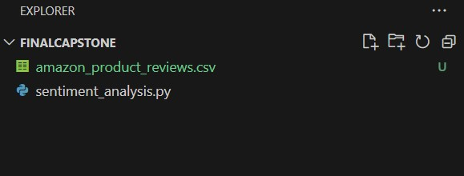
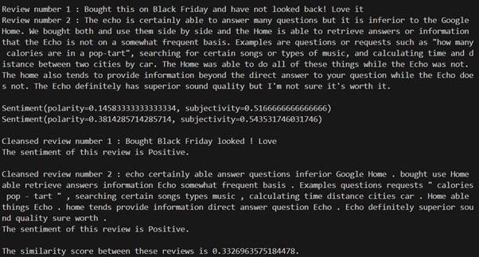

# PROJECT NAME
Sentiment_analysis.py

## DESCRIPTION
This Python program performs a sentiment analysis on a dataset of Amazon product reviews. 
It will randomly select two reviews from the database and compare the similarities based on polarity and subjectivity.

## ORDER OF THE PYTHON CODE
* Loading the needed libraries and read in the database file.
* Clean the database.
* Select two random reviews from database	.
* Function to remove stopwords from selected reviews.
* Function to perform sentiment analysis.
* Function to perform similarity analysis.
* Print results.

## INSTALLATION AND USAGE
Clone the finalCapstone to your terminal using the link <https://github.com/lechaucam/finalCapstone.git>
Install [Consumer Reviews of Amazon Products (kaggle.com). ](https://www.kaggle.com/datasets/datafiniti/consumer-reviews-of-amazon-products)
You can save it as a CSV file in the same folder as sentiment_analysis.py, naming it amazon_product_reviews.csv.
It will look like this.

 
Now run the sentiment_analysis.py file and this is an example of an outcome. 
Each time you run the code; 2 different reviews will be selected.

 

## CREDITS:
This Capstone project has been developed by me as an assignment for the HyperionDev bootcamp.

